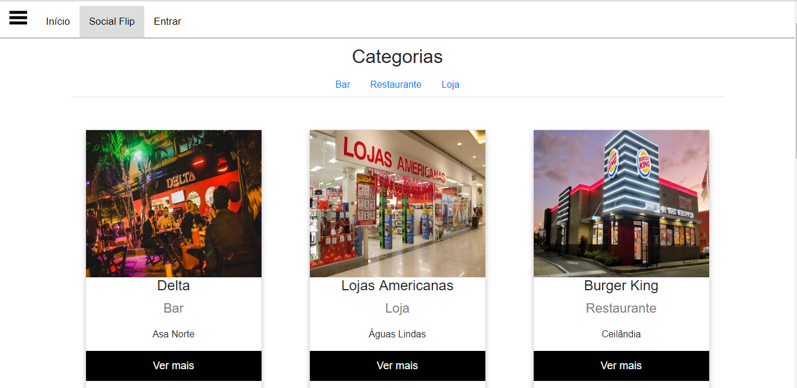

<h1>Guia comercial desenvolvido por Wilson Soares</h1>

<h2>Requisitos</h2>

<ul>
  <li>Ter o Apache instalado;</li>
  <li>Ter o Mysql instalado;</li>
  <li>Ou ter o Docker instalado.</li>
</ul>

<h2>Rodando com Docker</h2>

<ul>
  <li>docker-compose up -d.</li>
</ul>

<h2>Página inicial</h2>

